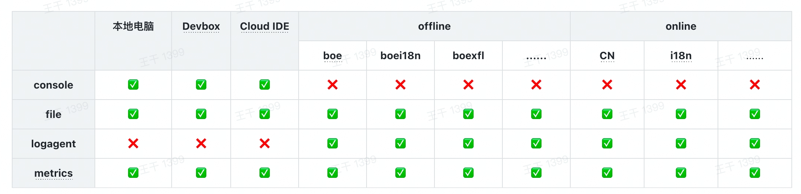

# @byted-service/logger

[](https://web-bnpm.byted.org/package/@byted-service/logger) [](https://web-bnpm.byted.org/package/@byted-service/logger)

[简体中文](https://code.byted.org/nodejs/byted-service/blob/master/packages/logger/README.md) | [English](https://code.byted.org/nodejs/byted-service/blob/master/packages/logger/README.en.md) | [CHANGELOG](https://code.byted.org/nodejs/byted-service/blob/master/packages/logger/CHANGELOG.md)

> 以下为 **@byted-service/logger@2.x** 文档，**1.x** 文档见 [logger-v1.x](https://code.byted.org/nodejs/byted-service/tree/logger-v1.x/packages/logger)、[@byted-service/logger@2.0.0 发版日志](https://bytedance.feishu.cn/wiki/wikcnwTrFMBrI0oZaYHxybzW0je)

**@byted-service/logger** 是公司内的基础日志模块，主要特性如下:

-   输出符合公司内日志规范的日志，具体见 [Node.js 日志使用指南 - @byted-service/logger](https://bytedance.feishu.cn/wiki/wikcnsLn77LSSKg996gVsKapAXg)
-   支持通过 [@byted-service/logagent](https://code.byted.org/nodejs/byted-service/blob/master/packages/logagent/README.md) 将日志上报至 `MS 平台`

如果你使用的框架已经集成了日志。不建议直接使用该模块，可以直接使用已经提供好的插件

-   Gulu: [@gulu/access-log](https://code.byted.org/nodejs/gulu/tree/master/packages/byted-gulu-access-log)
-   Koa & Express: [@fe/middlewares](https://web-bnpm.byted.org/package/@fe/middlewares)

## 安装

```bash
npm install @byted-service/logger --registry=http://bnpm.byted.org
```

## 快速开始

```js
const { Logger } = require('@byted-service/logger');
const logger = new Logger();

logger.info('hello world');
// 日志格式化规则与 util.format 一致
logger.info('hello %s', 'world');
logger.log({
    level: 'info',
    message: 'hello %s',
    splat: ['world'],
});
```

Tips: [util.format](https://nodejs.org/dist/latest/docs/api/util.html#util_util_format_format_args)

## API

### new Logger([options])

-   `options`
    -   `level`: 日志输出级别，默认为 `debug`，低于此级别的日志将不会做任何处理
    -   `defaultLevel`: 默认日志级别，默认 `info`
    -   `streams`: 日志输出流，具体见 [Streams](#streams)
    -   `flushInterval`: 日志刷新间隔，默认为 `10s`
    -   `consoleLogLevel`: `console` 日志级别，默认为 `options.level`
    -   `fileLogLevel`: 文件日志级别，默认为 `options.level`
    -   `agentLogLevel`: `logagent` 日志级别，默认为 `options.level`
    -   `metricsLevel`: `metrics` 打点级别，默认为 `warn`
    -   `enableConsoleLog`: 是否开启 `console` 日志，默认为 `isCloudIDE() || !isInTCE()` (包括本地开发环境、Cloud IDE 以及 Devbox)，具体见 [@byted-service/env](https://code.byted.org/nodejs/byted-service/tree/master/packages/env/README.md)
    -   `enableFileLog`: 是否开启文件日志，默认为 `true`
    -   `enableAgentLog`: 是否开启 `logagent` 日志，默认为 `!(isCloudIDE() || !isInTCE())`
    -   `enableMetrics`: 是否开启 `metrics` 打点，默认为 `true`
    -   `psm`: 项目 `psm`，默认为 `env.getPSM()`，具体见 [@byted-service/env](https://code.byted.org/nodejs/byted-service/tree/master/packages/env/README.md)
    -   `prefix`: 日志默认前缀
    -   `tags`: 全局日志 `tags`
    -   `tagKeys`: 日志 `tagKeys`，用于快速序列化日志 `tags`
    -   `callSiteFrameIndex`: 堆栈深度，用于获取调用日志位置。如果需要基于 `@byted-service/logger` 进行上层包装，请注意设置此值
    -   `enableSecMark`: 是否开启 `security mark`，默认 `false`，在 `TTP` 环境下默认 `true`，开启后会将 `key=value` 转换为 `{{key=value}}`，具体见 [TTP 环境使用指南 - @byted-service/logger](https://bytedance.feishu.cn/wiki/wikcn9yu4qGfXObjt40GN8ni9Lu)
    -   `file`: 日志文件，为数组时，将逐个尝试创建文件，但仅写入一个
    -   `rotatePattern`: 日志切割 `cron` 表达式，**仅实现了部分 cron 表达式，beta 功能请谨慎使用**，默认每小时切割一次
        -   `0 0 0 * *`: 每天切割一次
        -   `0 0 * * *`: 每小时切割一次
        -   `0 * * * *`: 每分钟切割一次
        -   `0 0 0,12 * *`: 每天 0 点和 12 点切割
        -   `0 0 0-3 * *`: 每天 0 点到 3 点切割
        -   `0 0 *\/2 * *`: 每天偶数小时切割
    -   `fileFormatter`: 日志切割文件 `formatter`，默认格式为 `/path/to/p.s.m.log.YYYY-MM-DD_HH:mm:ss`
        -   `file: 原始日志文件
        -   `date`: 对应的切割日期
    -   `dir`: 日志存放目录，当 `env.isTest() || env.isProd()` 为 `true` 时 ( 本地开发环境为 `false` )，默认为 `/opt/tiger/toutiao/log/app`，否则默认为 `${process.cwd()}/log`，具体见 [@byted-service/env](https://code.byted.org/nodejs/byted-service/tree/master/packages/env/README.md)
    -   `filename`: 日志文件名称，默认为 `options.psm`
    -   `ext`: 日志文件后缀，默认为 `.log`
        -   如果是访问日志，则填写 `.access.log`
        -   如果是 `rpc` 日志，则填写 `.call.log`
    -   `fallbackDirs`: 日志目录创建失败后的尝试目录，默认为 `` [`${process.cwd()}/log`, `${os.tmpdir()}/log`] ``，若全部失败，则创建日志实例失败
    -   `disableDirFallbackWarning`: 是否关闭日志目录创建失败时的输出，默认为 `false`
    -   `agent`: `logagent` 构造参数，具体见 [@byted-service/logagent](https://code.byted.org/nodejs/byted-service/blob/master/packages/logagent/README.md)
    -   `taskName`: `logagent` 日志类型标示，`_rpc` 代表 `rpc` 日志，默认为 `options.psm`
    -   `metrics`: `metrics` 构造参数，或 `metrics` 实例，具体见 [@byted-service/metrics](https://code.byted.org/nodejs/byted-service/blob/master/packages/metrics/README.md)

#### logger.level

日志输出级别，默认为 `options.level`，可动态进行设置

```js
const { Logger } = require('@byted-service/logger');
const logger = new Logger();

logger.level = 'info';
logger.info('hello world at info level'); // 输出

logger.level = 'warn';
logger.info('hello world at warn level'); // 不输出
```

Tips: 由于该 `API` 过于灵活，因此一般不建议直接使用

#### logger.levels

支持的日志级别，默认为

```js
{
    trace: 10,
    debug: 20,
    info: 30,
    warn: 40,
    error: 50,
    fatal: 60,
}
```

#### logger.defaultLevel

默认日志级别，默认为 `options.defaultLevel`

#### logger.tags

全局日志 `tags`，默认为 `options.tags`，用于在 `MS 平台` 上作为索引进行查询

#### logger.tagKeys

日志 `tagKeys`，用于快速序列化日志 `tags`，以提升性能

#### logger.isLevelEnabled(level)

日志级别是否开启

#### logger.fatal(message, [...splat])

#### logger.error(message, [...splat])

#### logger.warn(message, [...splat])

#### logger.info(message, [...splat])

#### logger.debug(message, [...splat])

#### logger.trace(message, [...splat])

```js
const { Logger } = require('@byted-service/logger');
const logger = new Logger();

logger.fatal('hello world');
logger.error('hello world');
logger.warn('hello world');
logger.info('hello world');
logger.debug('hello world');
logger.trace('hello world');
```

#### logger.log([args])

-   `args`
    -   `level: 日志级别，默认为 `options.defaultLevel`
    -   `message`: 日志内容
    -   `splat`: 日志格式化参数
    -   `logId`: 日志 `logId`，一般由框架层自动设置，具体见 [x-tt-logid](https://bytedance.feishu.cn/wiki/wikcn2L5x9IgQ4iLEdHofSMPVQc#qUpuqi)
    -   `location`: 日志调用堆栈位置，默认会自动计算
    -   `tags`: 日志 `tags`，与 `options.tags` 以 `Object.assign()` 形式合并，用于在 `MS 平台` 上作为索引进行查询

```js
const { Logger } = require('@byted-service/logger');
const logger = new Logger();

logger.log({
    level: 'info',
    message: 'hello %s',
    splat: ['world'],
    logId: 'some logid',
    location: 'some location',
    tags: {
        some: 'tags',
    },
});
```

#### logger.flush()

异步刷新日志到 [Streams](#streams)，默认根据 `options.flushInterval` 自动刷新

```js
const { Logger } = require('@byted-service/logger');
const logger = new Logger();

logger.info('hello world');
logger.flush();
```

#### logger.flushSync()

同步刷新日志到 [Streams](#streams)

```js
const { Logger } = require('@byted-service/logger');
const logger = new Logger();

logger.info('hello world');
logger.flushSync();
```

#### logger.clone([options])

复制日志实例，为轻量级复制，默认与原始 `logger` 共用相同 [Streams](#streams)

```js
const { Logger } = require('@byted-service/logger');
const logger = new Logger();
const childLogger = logger.clone();

childLogger.info('hello world');
```

#### logger.addStream(level, stream)

添加 [Streams](#streams)

```js
const { Logger } = require('@byted-service/logger');
const logger = new Logger();

logger.addStream('info', {
    write(msg) {
        console.log(msg);
    },
});

logger.info('hello world');
```

#### logger.deleteStream(level, stream)

删除 [Streams](#streams)

```js
const { Logger } = require('@byted-service/logger');
const logger = new Logger();

const stream = {
    write(msg) {
        console.log(msg);
    },
};
logger.addStream('info', stream);
logger.deleteStream('info', stream);

logger.info('hello world');
```

#### logger.getFinalLogger()

获取同步 logger，可以用于无法异步写日志的情况。例如:

-   process.on('uncaughtException')
-   process.on('unhandledRejection')

请不要直接使用 console.log，因为 console.log 是否同步，根据环境不同而不同，具体见文档: https://nodejs.org/dist/latest-v12.x/docs/api/process.html#process_a_note_on_process_i_o

-   仅适用于文件日志写入，不支持 `logagent`

```js
const { Logger } = require('@byted-service/logger');
const logger = new Logger();
const finalLogger = logger.getFinalLogger();

process.on('uncaughtException', (err) => {
    finalLogger.error(err, 'uncaughtException');
    process.exit(1);
});
```

### Streams

日志输出流，在 `@byted-service/logger` 中默认内置了 `console`、`file`、`logagent`、`metrcis` 四种日志输出流

-   如使用 [new Logger(\[options\])](#new-loggeroptions)，默认会添加上述日志输出流，可通过参数与环境变量控制
-   如使用 [new CoreLogger(\[options\])](#new-coreloggeroptions)，可通过 `logger.addStream()` 与 `logger.deleteStream()` 进行控制

#### createConsole()

创建 `console` 输出流

```js
const { CoreLogger, createConsole } = require('@byted-service/logger');
const logger = new CoreLogger();

logger.addStream('info', createConsole());

logger.info('hello world');
```

#### createFileRotate([options])

创建 `file` 输出流，**兼容老版本 `logger`**，具体见 [@byted-service/logger 升级须知](https://bytedance.feishu.cn/wiki/wikcn5dsQLTFYuGBdbB7ULRFHpb#99sYNJ)

-   `options`
    -   `psm`: 项目 `psm`，默认为 `env.getPSM()`，具体见 [@byted-service/env](https://code.byted.org/nodejs/byted-service/tree/master/packages/env/README.md)
    -   `file`: 日志文件，为数组时，将逐个尝试创建文件，但仅写入一个
    -   `rotatePattern`: 日志切割 `cron` 表达式，**仅实现了部分 cron 表达式，beta 功能请谨慎使用**，默认每小时切割一次
        -   `0 0 0 * *`: 每天切割一次
        -   `0 0 * * *`: 每小时切割一次
        -   `0 * * * *`: 每分钟切割一次
        -   `0 0 0,12 * *`: 每天 0 点和 12 点切割
        -   `0 0 0-3 * *`: 每天 0 点到 3 点切割
        -   `0 0 *\/2 * *`: 每天偶数小时切割
    -   `fileFormatter`: 日志切割文件 `formatter`，默认格式为 `/path/to/p.s.m.log.YYYY-MM-DD_HH:mm:ss`
        -   `file: 原始日志文件
        -   `date`: 对应的切割日期
    -   `dir`: 日志存放目录，当 `env.isTest() || env.isProd()` 为 `true` 时 ( 本地开发环境为 `false` )，默认为 `/opt/tiger/toutiao/log/app`，否则默认为 `${process.cwd()}/log`
    -   `filename`: 日志文件名称，默认为 `options.psm`
    -   `ext`: 日志文件后缀，默认为 `.log`
        -   如果是访问日志，则填写 `.access.log`
        -   如果是 `rpc` 日志，则填写 `.call.log`
    -   `fallbackDirs`: 日志目录创建失败后的尝试目录，默认为 `` [`${process.cwd()}/log`, `${os.tmpdir()}/log`] ``，若全部失败，则创建日志实例失败
    -   `disableDirFallbackWarning`: 是否关闭日志目录创建失败时的输出，默认为 `false`

```js
const { CoreLogger, createFileRotate } = require('@byted-service/logger');
const logger = new CoreLogger();

logger.addStream('info', createFileRotate({
    file: '/path/to/xxx.log';
}));

logger.info('hello world');
```

#### createLogAgent([options])

创建 `logagent` 输出流

-   `options`
    -   `agent`: `logagent` 构造参数，具体见 [@byted-service/logagent](https://code.byted.org/nodejs/byted-service/blob/master/packages/logagent/README.md)
    -   `taskName`: `logagent` 日志类型标示，`_rpc` 代表 `rpc` 日志，默认为 `env.getPSM()`，具体见 [@byted-service/env](https://code.byted.org/nodejs/byted-service/tree/master/packages/env/README.md)

```js
const { CoreLogger, createLogAgent } = require('@byted-service/logger');
const logger = new CoreLogger();

logger.addStream('info', createLogAgent());

logger.info('hello world');
```

#### createMetrics([options])

创建 `metrics` 输出流

-   `options`
    -   `metrics`: `metrics` 构造参数，或 `metrics` 实例，具体见 [@byted-service/metrics](https://code.byted.org/nodejs/byted-service/blob/master/packages/metrics/README.md)

```js
const { CoreLogger, createLogAgent } = require('@byted-service/logger');
const logger = new CoreLogger();

logger.addStream('info', createMetrics());

logger.info('hello world');
```

#### new FileRotateStream(options)

创建 `file` 输出流，**不兼容老版本 `logger`**，具体见 [@byted-service/logger 升级须知](https://bytedance.feishu.cn/wiki/wikcn5dsQLTFYuGBdbB7ULRFHpb#99sYNJ)

-   `options`
    -   `file`: 日志文件，为数组时，将逐个尝试创建文件，但仅写入一个
    -   `rotatePattern`: 日志切割 `cron` 表达式，**仅实现了部分 cron 表达式，beta 功能请谨慎使用**，默认每小时切割一次
        -   `0 0 0 * *`: 每天切割一次
        -   `0 0 * * *`: 每小时切割一次
        -   `0 * * * *`: 每分钟切割一次
        -   `0 0 0,12 * *`: 每天 0 点和 12 点切割
        -   `0 0 0-3 * *`: 每天 0 点到 3 点切割
        -   `0 0 *\/2 * *`: 每天偶数小时切割
    -   `fileFormatter`: 日志切割文件 `formatter`，默认格式为 `/path/to/p.s.m.log.YYYY-MM-DD_HH:mm:ss`

```js
const { CoreLogger, FileRotateStream } = require('@byted-service/logger');
const logger = new CoreLogger();

logger.addStream(
    'info',
    new FileRotateStream({
        file: '/path/to/xxx.log',
    })
);

logger.info('hello world');
```

### new CoreLogger([options])

`logger` 核心，可用于最大限度自定义 `logger` 实现

-   `options`
    -   `level`: 日志输出级别，默认为 `debug`，低于此级别的日志将不会做任何处理
    -   `defaultLevel`: 默认日志级别，默认 `info`
    -   `formatter`: 日志格式化器
    -   `streams`: 日志输出流，具体见 [Streams](#streams)
    -   `flushInterval`: 日志刷新间隔，默认为 `10s`

## 环境变量

鉴于历史包袱，可以通过对应环境变量来达到不修改代码，控制日志输出

### 日志级别

-   可选值 ( 不在可选值范围内的值将直接忽略 )

    -   `fatal`: 导致程序不可用的严重错误
    -   `error`: 对于某个操作的严重错误，但程序不受影响
    -   `warn`: 可能导致程序进入异常状态的问题
    -   `info`: 正常的信息 ( 如服务启/停 )
    -   `debug`: 用于程序调试的信息
    -   `trace`: 用于追踪程序运行或请求调用链的信息

-   级别大小: `fatal` > `error` > `warn` > `info` > `debug` > `trace`

相关环境变量:

-   `LOGGER_OUTPUT_LEVEL`: 默认日志级别，低于此级别的日志将不会做任何处理
-   `LOGGER_LEVEL_CONSOLE`: `console` 日志级别
-   `LOGGER_LEVEL_FILE`: `file` 日志级别
-   `LOGGER_LEVEL_LOGAGENT`: `logagent` 日志级别
-   `LOGGER_LEVEL_METRICS`: `metrics` 日志级别

```shell
# 此时所有低于 error 级别的日志都不会输出
LOGGER_OUTPUT_LEVEL=error node app.js
```

参数优先级:

-   通用输出级别: `options.level` > `LOGGER_OUTPUT_LEVEL` > `默认 info`
-   `console` 日志级别: `options.consoleLogLevel` > `LOGGER_LEVEL_CONSOLE` > `options.level` > `LOGGER_OUTPUT_LEVEL` > `默认 info`
-   `file` 日志级别: `options.fileLogLevel` > `LOGGER_LEVEL_FILE` > `options.level` > `LOGGER_OUTPUT_LEVEL` > `默认 info`
-   `logagent` 日志级别: `options.agentLogLevel` > `LOGGER_LEVEL_LOGAGENT` > `options.level` > `LOGGER_OUTPUT_LEVEL` > `默认 info`
-   `metrics` 日志级别: `options.metricsLevel` > `LOGGER_LEVEL_METRICS` > `默认 warn`

### 日志组件开启

-   可选值 ( 不在可选值范围内的值将直接忽略 )
    -   `true`: 开启日志
    -   `false`: 关闭日志

相关环境变量:

-   `LOGGER_ENABLE_CONSOLE`: 是否开启 `console` 日志
-   `LOGGER_ENABLE_FILE`: 是否开启 `file` 日志
-   `LOGGER_ENABLE_LOGAGENT`: 是否开启 `logagent` 日志
-   `LOGGER_ENABLE_METRICS`: 是否开启 `metrics` 日志

```shell
# 此时所有 logagent 日志都不会输出
LOGGER_ENABLE_LOGAGENT=false node app.js
```

参数优先级:

-   `console` 日志: `options.enableConsoleLog` > `LOGGER_ENABLE_CONSOLE` > `默认规则`
-   `file` 日志: `options.enableFileLog` > `LOGGER_ENABLE_FILE` > `默认规则`
-   `logagent` 日志: `options.enableAgentLog` > `LOGGER_ENABLE_LOGAGENT` > `默认规则`
-   `metrics` 日志: `options.enableMetrics` > `LOGGER_ENABLE_METRICS` > `默认规则`

各环境日志默认规则：



### 日志时区

相关环境变量:

-   `LOGGER_TIME_ZONE`: 日志时区

```shell
# 此时日志时区为 America/New_York
LOGGER_TIME_ZONE=America/New_York node app.js
```

### Security Mark

相关环境变量:

-   `LOGGER_ENABLE_SEC_MARK`: 是否开启 `Security Mark`，用于 `TTP` 环境，具体见 [TTP 环境使用指南 - @byted-service/logger](https://bytedance.feishu.cn/wiki/wikcn9yu4qGfXObjt40GN8ni9Lu)

```shell
# 关闭 Security Mark
LOGGER_ENABLE_SEC_MARK=false node app.js
```

### Logger Hook

从 `>2.4.0` 版本支持了 hook 功能，用于业务处理日志打印内容，比如日志中不打印敏感信息等，使用方式如下：

```typescript
import { Logger, InputData } from '@byted-service/logger';

const logger = new Logger();

logger.addHook((input: InputData) => {
    input.message = input.message.replace(/\d+/, '****');
    return input;
});

logger.info('hello 123456'); // hello ****
```

## Metrics 打点

指标名称:

```
// 日志调用计数，可被 options.metrics 参数修改
toutiao.service.log.${psm}.throughput
```

**tags**:

<details>
  <summary>History</summary>

-   `v2.0.6`: 支持 `env`、`version`

</details>

-   `level`: 日志级别
-   `cluster`
-   `env`
-   `version`: `@byted-service/logger` 版本
