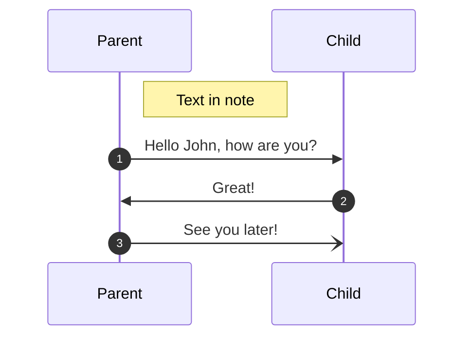

# Descendant

> Fork from https://github.com/chakra-ui/chakra-ui/tree/0258907047460c43716c1049bef25dfa01515e3e/packages/components/descendant
>
> Thanks for @chakra-ui

## 为什么我们需要这个库？

为了处理类似 rc-menu eventKey 这样的场景，compound component 可以知道自己在父级中所处的位置（index）

## 为什么我们要 fork 一份自己实现？

由于 chakra 实现 descendant 时没有注意到一些细节（也可能是刻意为之），比如说

- ref 引用变化
- 子元素自身 rerender 时，parent 和 sibling 组件无法感知 index 变化

## 实现思路梳理

### 一次初始化渲染

- Parent render
- Parent 创建 descendant manager
- Child render
  - state.index === -1
- Child register
  - manager 重新计算节点顺序，并给 dom 赋值 data-index
- Child layoutEffect
  - 获取 data-index，data-index !== 当前 state.index 则 setIndex，触发 Child rerender
- 结束初始化渲染

### 一次子节点卸载

> react 18 看起来是这样的：layoutEffect cleanup -> ref null -> 上层组件 layoutEffect cleanup -> 上层组件 ref null -> effect cleanup -> 上层组件 effect cleanup

```tsx
const Children = () => {
  return <>
  <Child>
  <Child>
  <Child>
  </>
}

<Parent>
  <Children>
</Parent>
```

- Child 卸载
- Child layoutEffect cleanup，unregister
  - manager 重新计算节点顺序，并给 dom 赋值 data-index
- Child ref = null，触发 register，因为 node 为空所以跳过注册


