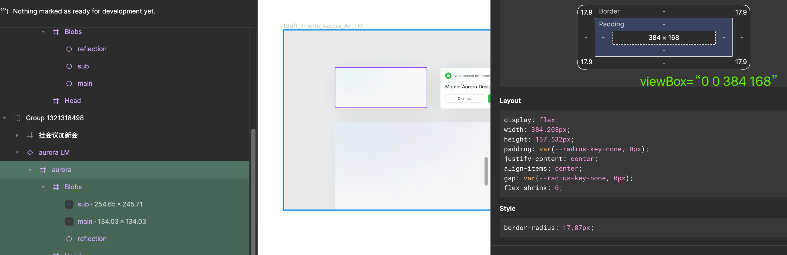
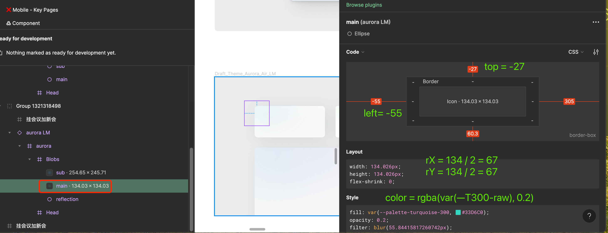

## 极光渐变 AuroraBlock

## 基本用法

基本用法，直接使用默认的极光效果。
<code src="./demo/basic.tsx" />

## 关闭动画

在低性能机器上，或性能要求高的场景，可以使用 `noAnimation` API 关闭动画。
<code src="./demo/no-animation.tsx"  />

<!-- ## 自定义颜色、尺寸等信息

极光背景使用三个椭圆加上模糊滤镜实现的，我们可以自定义 3 个椭圆的大小、位置、填充色，以便实现各种自定义效果：

这三个椭圆从左到右依次叫做： mainEllipse、subEllipse、reflectionEllipse。

可以指定每个椭圆的尺寸、颜色等信息。
<code src="./demo/config.tsx" /> -->

## 实现 Figma 设计稿里面的效果
1. 首先，找到设计稿上的 aurora 组件，确定 viewBox 参数：

2. 找到名称为  main、sub 和 reflection 的三个椭圆，将椭圆的各个参数抄下来。这里以 main 为例，从右边就可以看到这个圆的参数了：

依次将三个椭圆参数设置完毕之后，得到以下效果：

<code src="./demo/figma.tsx" />

## 作为背景

极光效果通常作为背景使用，此时需要将内容置于极光动画之上。我们提供了 AuroraContainer、AuroraContent 组件，帮助你实现叠放效果。
<code src="./demo/container.tsx" />

## 所有配置

所有可以配置的属性。
<code src="./demo/all.tsx" />

## API

#include(react-aurora.aurorablockprops.md)
#include(react-aurora.ellipsetype.md)
