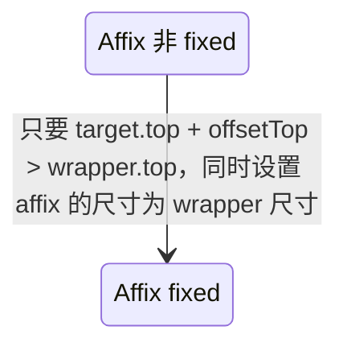

### 组件结构

```tsx
<TargetContainer ref={target}>
  <Wrapper ref={wrapper}>
    <Placeholder ref={placeholder} />
    <Affix ref={affix}>{children}</Affix>
  </Wrapper>
</TargetContainer>
```

### 组件逻辑



监听了 wrapper 和 children 的 resize，更新路径如下，可能会存在成环的情况

1. wrapper -> affix
2. children -> placeholder
