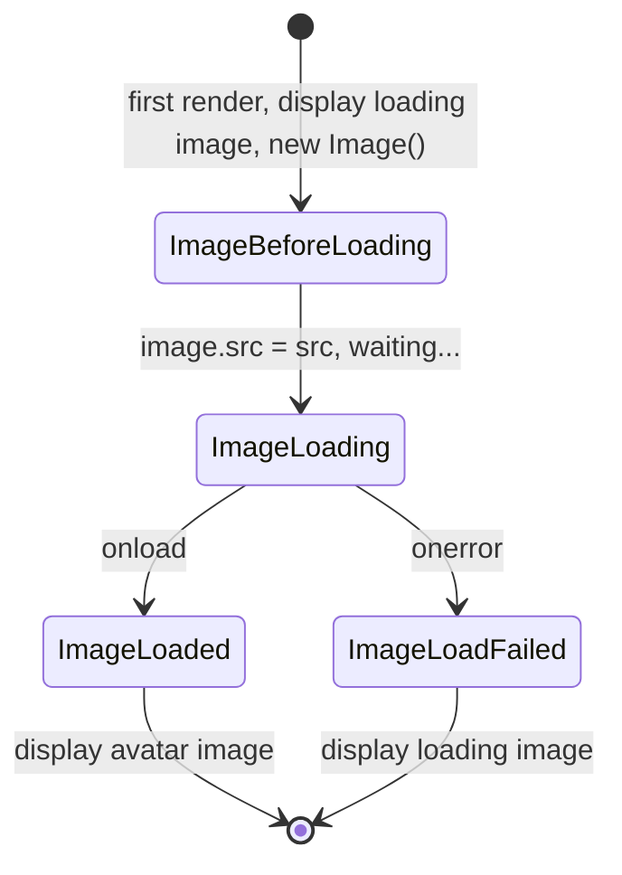
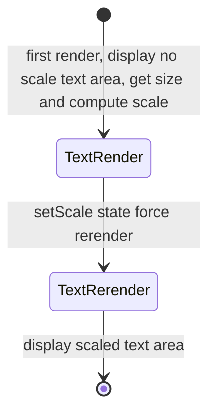

# @universe-design/Avatar

## References

1. [研发设计文档](https://bytedance.feishu.cn/wiki/wikcn3ZdOGX0D0iB1KKEj5LDBPb)

2. [Desktop & Web 端 - 头像 Avatar](https://bytedance.feishu.cn/wiki/wikcnFp913c755TUfRJ9IwclS1I?from=from_parent_docs)

3. [Ant Design Avatar](https://ant.design/components/avatar/)

4. [Chakra Avatar](https://chakra-ui.com/avatar)

### Preview

[轻服务在线预览 Online Demo](https://ux-review-universe-ui.web.bytedance.net/?path=/docs/components-avatar--personal-avatar)

## Attributes

### Avatar

```typescript
export type AvatarPropColor = PresetColorType;

export interface AvatarProps extends React.HTMLAttributes<HTMLDivElement> {
  /**
   * 是否为有边框头像
   */
  bordered?: boolean;
  /**
   * 头像尺寸
   * @description 一共具有 "m" | "s" | "xs" 五种尺寸
   */
  size?: SizeType;
  /**
   * 头像形状
   * @description 方形和圆形，方形不同尺寸的 border-radius 有区别
   */
  shape?: 'square' | 'circle';
  /**
   * 头像颜色
   * @description 我们只对 12 种 preset color 做了不同 colorStyle 的适配，如果用户需要
   * 自定义则可以覆盖 class 和 style。
   */
  color?: AvatarPropColor;
  /**
   * 头像的颜色样式
   * @description
   * - `平铺` prop color 为背景，text-color-inverse 为字色
   * - `轮廓` prop color 为字色和 border 色，背景为透明色
   */
  colorStyle?: 'filled' | 'outlined';
  /**
   * 头像的图片链接
   * @description 当提供 src 时，组件优先判定为 image 类型的头像。
   * image 头像 src 加载过程中会显示默认的灰色加载头像，加载成功后显示图片。
   */
  src?: string;
  /**
   * 头像 loading 或者获取不到时的显示 icon
   * @description 默认使用内置的 MemberFilled icon 作为 fallback
   */
  fallbackIcon?: (size: { width: number; height: number }) => React.ReactNode;
  /**
   * 隐藏属性，显示 image loading 态
   * @ignore
   */
  loading?: boolean;
  /**
   * 头像的显示文字
   * @description 当提供 text 时，组件判断为 text 类型头像。
   * text 头像对于方块字（中、日）一行最多 2 个 char，对于拉丁系一行最多 4 个 char，一共显
   * 示两行。字体默认为 18px, 根据渲染的大小计算文字部分是否需要缩放。
   */
  text?: string;
  /**
   * 头像文字的左右填充
   * @defaultValue 0
   * @description 在 text 模式下，计算文字区域缩放时可以加入 padding，提供更 loose 的感觉
   */
  gap?: number;
  /**
   * 图标头像
   * @description 当指定 icon，头像判断为 icon 类型头像。
   * icon 头像通过 top bottom 50% 和 translateXY -50% 做到 icon 在容器内部居中。
   *
   * 默认情况下，我们对内部的 svg 设置为 50%, 50% container 尺寸。
   * 但是，我们也将 icon 属性设计为 renderProps 给用户传入一个建议尺寸。
   */
  icon?: (size: { width: number; height: number }) => React.ReactNode;
}
```

### AvatarGroup

```typescript
interface AvatarGroupProps {
  /**
   * 头像收起的最大阈值数
   * @defaultValue 5
   * @description 当 avatars.length > maxCount 时，
   * 则会将多余的收起显示 **多余占位头像**，内容为 `avatars.length - maxCount`
   */
  maxCount?: number;
  /**
   * 右侧 **多余占位头像** 的样式
   */
  maxStyle?: React.CSSProperties;
  /**
   * 需要并列的头像列表
   * @description 为了良好的 type 定义，以及避免用户不可预知的使用情况，
   * 我们选择直接传入 avatar props list 并帮助用户渲染。
   */
  avatars?: (AvatarProps & { key: React.Key })[];
  /**
   * 头像之间的水平 margin 间距
   */
  spacing?: number;
}
```

### BadgeAvatar

```typescript
export interface BadgeAvatarProps extends AvatarProps {
  badgeProps: BadgeProps;
}
```

## Composition

```yaml
AvatarContainer:
  desc: 头像的主体容器，用于内容定位
  children:
    oneOf:
      AvatarImage:
        desc: 图片类型的头像内容物
      AvatarText:
        desc: 文字类型的头像内容物
      AvatarIcon:
        desc: 图标类型的头像内容物
```

## State & Sequence & Algorithm

| props 类型            | 头像类型 | 描述     |
| --------------------- | -------- | -------- |
| src                   | image    | 图片头像 |
| !src && text          | text     | 文字头像 |
| !src && !text && icon | icon     | 图标头像 |

### `ImageAvatar`

#### 图片加载 algorithm

组件状态图如下



### `TextAvatar`

#### 文字区域缩放 algorithm

初始字号 18px，position absolute。每 4 个 unit 进行一次换行，最多显示 8 unit 字符，中日韩汉字、日语平假名片假名占 2 unit，拉丁语系及其他语言每个字符为 1 unit。

缩放计算方法如下，

1. 获取头像 size，知道头像内切圆边界, $C_w$, $C_h$
2. 获取当前 text area size，$T_w$, $T_h$
3. 获取, gap, $C_{padding}$
4. 计算 $T_wmax$

$$
(C_w - C_{padding} * 2)^2 = T_wmax^2 + T_hmax^2 = T_wmax^2 * (1 + (T_h / T_w)^2) \\
T_wmax = \frac{(C_w - C_{padding} * 2)}{\sqrt{1 + (T_h / T_w)^2}}
$$



### `IconAvatar`

纯展示，内部 svg 尺寸为 container 的一半

### `AvatarGroup`

接受多个 avatar props 对象，inline 排列，并接受一个负值 margin 做相互重叠。

### `AvatarBadge` algorithm

头像徽标是一般表示在线状态或协作状态等，我们头像的 shape 和 size 逻辑较为复杂，为了精准定位，我们设计为给 Avatar 组件传入 Badge 组件，由 Avatar 控制 Badge 的 offset，并直接提供 BadgeAvatar 组件。offset 计算方法如下，

$$
(x , y) = (- (1 - \frac{1}{\sqrt{2}}) * borderRadius, - (1 - \frac{1}{\sqrt{2}}) * borderRadius)
$$

## Accessibility considerations

暂无
