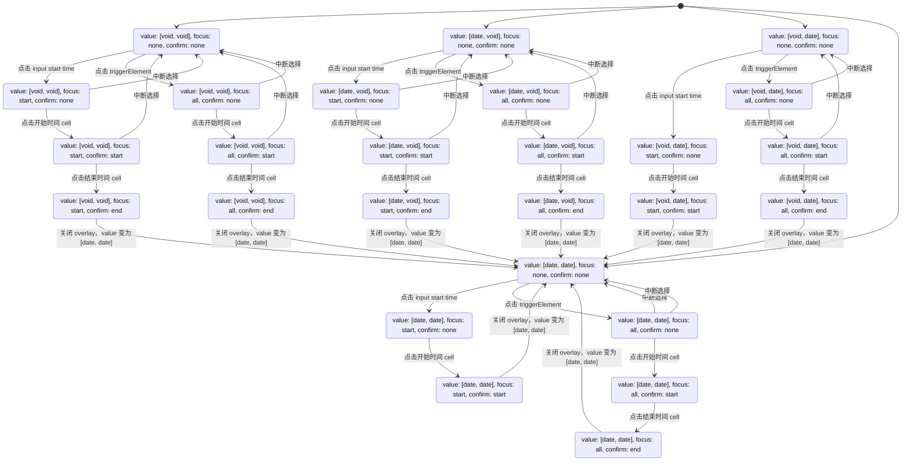

# Date Picker

## 用例设计

### Footer

- `renderExtraFooter` 属性与 `Other DS` 设计不同，这个属性用于直接覆盖默认 `footer`
- 对于 `DatePicker` 来说，当面板 `mode` 为 `date` 并且 `showToday` 为 true 时，存在默认的 `Today` 按钮，点击以后可以选中今天
- 对于 `RangePicker` 来说，当面板 `mode` 为 `date` 并且 `ranges` 不为空时，存在多个预设按钮，和一个确认按钮
  - 点击预设按钮只改变面板状态，不触发 `onChange`，不改变最终的组件值
  - 点击确定改变最终的组件值，并且关闭面板

Focus: start

Focus: end，刚好是 Focus start 的反向操作

### showTime

当设置 showTime 时，显示时间选择。 显示格式变为： YYYY-

1. 如何设置显示哪些选项（时、分、秒）？

- 通过 format 识别
- 通过 showTime 指定

2. confirmButton 逻辑
   1. 非 showTime （默认）
      1. confirmButton = false (默认) 选中即提交
      2. confirmButton = true 选中点击确定按钮提交，点击弹窗外部 取消
   2. showTime !== false
      1. confirmButton = true （默认） 选中点击确定按钮提交，点击弹窗外部取消
      2. confirmButton = false, 点击外部提交， 点击内部弹窗不关闭。

### defaultPickerValue

参考： [defaultPickerValue 的设计](https://bytedance.feishu.cn/docx/doxcnL1AFiZAwco4vrVouyhAeBc)

### 面板切换策略

文字描述：「用户完全控制 + Phase 或 viewValue 变化，引起的 pickerValue 变化」

#### 默认值

value > defaultPickerValue > now()

#### 触发事件

我们不选择使用 render compute，而是事件触发，因为在某些情况下我们的 pickerValue 值是会根据 event 不同而使用不同的。

| 事件                        | 引起变化类型                                                                                                                                           | 说明                                                             |
| --------------------------- | ------------------------------------------------------------------------------------------------------------------------------------------------------ | ---------------------------------------------------------------- |
| 清空                        | viewValue 变化                                                                                                                                         |                                                                  |
| input[onChange]             | viewValue 变化                                                                                                                                         |                                                                  |
| 点击 pre/next               | 用户完全控制                                                                                                                                           |                                                                  |
| focus(点击，Tab 切换) input | Phase 变化                                                                                                                                             |                                                                  |
| 切换年份                    | 用户完全控制                                                                                                                                           |                                                                  |
| 点击 date cell              | viewValue 变化（Phase 其实也会变化，但是我们这里会用 current phase 而非 next phase 进行计算，因为我们认为点击 date cell 和 input onChange 是等价操作） | 此时可能点击到上个面板或者下个面板透出来的日期，此时需要面板跳转 |

#### 切换规则

1. 按当前 phase 取出 viewValue 中对应的 date 值
2. 计算 nextPickerValue 值（viewValue[phase] > defaultPickerValue[phase]）
   1. 若 nextPickerValue 为空，则不切换
   2. 若 nextPickerValue 不为空，则切换。这里要注意，当 phase 是 startDate 时，pickerValue 设置为 nextPickerValue，当 phase 是 endDate 时，将 pickerValue 设置为 prev(nextPickerValue, mode)

## 光标跟随输入定位

当用户在面板中选中一个日期后，光标会自动跳转到下个 phase 对应的输入框。如选择了开始时间，接下来应该要选择结束时间，此时光标应该从开始时间跳转到结束时间。
几个交互场景：https://bytedance.feishu.cn/docx/doxcnKjyRtPEDa2tIXZZdG2fASd
