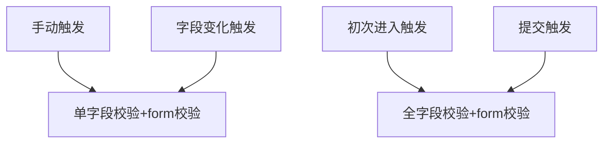

# Form 组件设计

[The Best React Form Library To Use In 2020](https://medium.com/frontend-digest/the-best-react-form-library-to-use-in-2020-11e93c267e4)

## 现状调研


- [Formik 2.1.6](https://formik.org/docs/overview)
- [React Hook Form](https://react-hook-form.com/)
- [React Final Form](https://final-form.org/react)
- [RC Field Form](http://react-component.github.io/field-form/)

### Benchmark

| Lib                    | Count | Update Cost | Input Task | Mount     |
| ---------------------- | ----- | ----------- | ---------- | --------- |
| Formik                 | 5000  | 64.06ms     | 220ms      | 3604.59ms |
| React Hook Form        | 5000  | 0.90ms      | 37ms       | 3353.78ms |
| React Final Form       | 5000  | -           | -          | -         |
| RC Field Form          | 5000  | 0.79ms      | 102ms      | 703.92ms  |
| React                  | 5000  | 16.52ms     | 37ms       | 413.75ms  |
| React Context Selector | 5000  | 7.16ms      | 49ms       | 436.66ms  |
| **React Mini Form** 🤩 | 5000  | 0.56ms      | 49ms       | 557.46ms  |

## Form 组件主要需要具备哪些功能

### 优化渲染减少表单项不必要的 rerender

用户如果自己用表单元素组装表单，若处理不好，很容易在表单项过多的情况下会出现性能问题。React 不像 Vue，用户可以在不做任何处理的情况下得到定点精准的更新，所以如果要完成一个巨快的 form，需要一些特殊的处理。以下是一个巨快的 form 的最简实现。其中有两点需要注意：

1. form 里面的表单元素不能指定 name，指定 name 会让初始化状态变得很慢。在 benchmark 实验中我们发现，form item 的 name prop 非常耗时（此处划重点），在 5000 count 时，填写 name 为 3200 ms 左右，而不填写 name 的情况下则是 400 ms 左右。所以尽可能不用 name。
2. form.item 不要直接写在 form 组件内部，需要用 memo 或 purecomponent 处理单独写成一个组件，保证更新的时候不触发额外计算

```tsx
const Field = memo(({ name, value, setValue }) => {
  return (
    <input
      onInput={e => {
        setValue(index, e.currentTarget.value);
      }}
      value={value}
    />
  );
});

const App = () => {
  const [data, setData] = useState({});
  const setValue = useCallback((name, value) => {
    setValues(values => ({ ...values, [name]: value }));
  }, []);

  return (
    <form>
      {Array(1000)
        .fill(0)
        .map((_, index) => {
          return <Field key={index} value={values[index]} name={index} setValue={setValue} />;
        })}
    </form>
  );
};
```

可以看到，用户必须要单独实现一下表单组件的 wrapper，我们提供 form 组件就为了简化用户的操作，让用户可以直接在 form 函数体里面写 form item 相关的逻辑，并保证高效的首屏和更新效率。

### 简化统一 UI

form 里面的表单元素一般都不包含 error message, help, label 等信息的渲染逻辑，原生 form 提供 label + for prop 的组合给一个表单元素指定一个 label。这些内容其实我们也是可以做到 Form 组件里面的，这样可以简化用户的工作，有利于统一 UI。Formik 和 react-hook-form 都不提供 UI 层面的内置，对于 error message 只提供对应的 error string，对于其他 UI 样式则也完全需要用户自己来做。

AntD 对 form 的整体 size，grid 布局也做了一些功能支持。

```tsx
<Field name={['name']} label={'Name'} help={'name is a prop'}>
  <input />
</Field>
```

### 与表单项交换数据

从上面的例子也可以看到，我们声明了 state 去管理 formData，并且封装了 setValue 函数让 Field 帮助收集字段变化时的数据。为了简化这个过程 form 组件内部会帮助用户建立收集 state，field 组件提供两种集成方式，一种是 childrenProp，用户自己将需要的传递的 prop 传入表单项。最关键的是 value 和 onChange，value 用于控制表单项的显示值，onChange 用于收集变化值到 state 里面。html 标准里面，不同的表单项并不都是通过 value 和 onChange 来进行，vue v-model 做了以下的处理

- text 和 textarea 元素使用 value property 和 input 事件；原生 input 组件 onchange 事件只在 blur 时触发。
- checkbox 和 radio 使用 checked property 和 change 事件；
- select 字段将 value 作为 prop 并将 change 作为事件；

[React Forms](https://reactjs.org/docs/forms.html) 已经将原生事件做了一些改变，全都可以通过 onChange 来进行数据的收集，只是 checkbox 和 radio 还是需要通过 checked key 来受控。select multiple 模式需要通过 options 的 selected 状态来获取数据

对于自定义的表单组件，我们也都使用 onChange 来进行数据收集，并不是所有的 onChange 都可以传入 event，就算传入了 event 也不一定能够得到有效的 target 取得 value，所以一般自定义组件都会直接传入 value 作为第一个参数。总结上面的描述我们可以得知，Field 的 handleChange 逻辑如下：

1. 判断传入 handleChange 函数的第一个参数是不是 SyntheticBaseEvent 对象，如果是则进入 2，如果不是则进入 6；
2. 判断 event.target 类型，如果是 input 则进入 3，如果是 select 进入 5；
3. 如果是 target.type 是 checkbox 或 radio 则使用 target.checked 作为表单此次变更的值；如果不是则进入 4；
4. 如果是 file，报错，file 的 value 为只读，不能修改，如果是其他则作为 text 处理，使用 target.value 作为表单的变更值；
5. 判断 select.multiple，如果是 false，使用 target.value 作为表单的变更值；如果是 true，通过 target.options 计算返回值数组；
6. 直接把第一个参数作为返回值；

此外，我们也提供 `valuePropName` 和 `trigger` 来让用户可以自己指定受控值的名字和获取数据的回调名称

```tsx
<Field name={['gender']}>
  {({ value, onChange, touched, isSubmitting, isValidating, error }) => (
    <Select value={value} onChange={onChange} loading={isSubmitting || isValidating} error={Boolean(error)} />
  )}
</Field>
```

#### 对于 field name 设计的解释

field name 是用于表单元素告知 form 组件他在 form-data 中的 key 是什么，为了支持嵌套层级的 form-data 结构，原生一般会通过用非规范的 `json path` 表示来作为 name，后端会根据 name 来解析成嵌套层级，Formik, react-hook-form, 以及 rc-form 都是使用了这个做法，但是将这个过程移到了前端，rc-field-form 改成了 `string[]` 作为 name path，因为之前的规范中用 `.` 作为 prop key 之间的分隔符，这个做法对 `key` 本身就带 `.` 的情况不友好（我记得 azkaban 的 json 里面就遇到有带点的，可能是 java 后端那边的习惯吧）。

我们准备使用 `string[]` 作为 name path，这个坑更少一些，**但是 field 就需要处理 `string[]` 的 memo equal 逻辑，做个浅比较**。

### 提交数据

[原生 form](https://developer.mozilla.org/en-US/docs/Web/HTML/Element/form) 的行为是，如果 form 内部的 `<button type="submit" />` `<input type="submit">` `<input type="image">` 组件触发提交操作，则会向 form.action 的链接做一次 post 请求，body 通过 enctype 指定，可以有以下几种类型：

- application/x-www-form-urlencoded: The default value.
- multipart/form-data: Use this if the form contains input elements with type=file.
- text/plain: Introduced by HTML5 for debugging purposes.

action 和 enctype 可以被 submit 组件的 `formaction` 和 `formenctype` 覆盖。submit 默认会触发页面的刷新，如果需要禁止这个行为则需要在 onsubmit 里使用 e.preventDefault()禁止。如果需要在 submit 的时候获取 formdata 使用 js 处理，可以通过 `var formData = new FormData(someFormElement);` 获取 formData。

AntD 通过自定义的 onFinish 进行 submit 触发的回调，Formik 通过自动以的 onSubmit 进行 submit 回调触发。回调第一个参数都是当前 form 的 values 状态。只有校验通过才会触发，formik 增加了 setSubmit 来让用户指定是否为 submit 状态，表单会进入 loading 状态。

我们准备借鉴 react-hook-form 的做法，onSubmit 返回一个 Promise，promise 开始的时候就把 form 变成 submitting 状态，resolve 或 reject 的时候把状态改为未提交状态。

```tsx
<Form
  onSubmit={values => {
    // do submit
    return Promise.resolve();
  }}
/>
```

### 字段校验

AntD 使用 async-validator 作为校验库，内置了很多的正则帮助方法，需要写在每个 field 的 prop 里；Formik 提供一个 validate 方法，并提供 validateSchema 接受 yup schema 作为校验库，写在 form prop 里；react-hook-form 提供一个通用的 resolver 来处理校验，并官方提供了 `yupResolver` transformer 来集成 yup，这个蛮合理的，相当于 formik 直接提供一个 validate，并提供 validate 的 transformer，写在 form prop 里。

对比下来，AntD 的做法比较独特，可能觉得 field 校验逻辑还是和 field 放得近一些比较好，剩下的两个做法是一致的。我觉得后两种更好，联合校验和单值校验都很容易。直接返回一个与 formdata 完全一致的数据结构，每个 key 的 value 都可以是一个 error string。

```tsx
<Form
  // 可以返回 promise 进行异步数据校验，也可以同步返回
  validate={values => {
    return Promise.resolve({
      name: name === 'Gu Xiang' ? 'Name is incorret' : undefined,
      gender: false as false | null | undefined,
    });
  }}
/>
```

```
# Formik validation 逻辑
runValidateHandler(values, field): Promise<FormError>
  -> form.validate(values, field): Promise<FormError>

runSingleFieldLevelValidation(field, value): Promise<string>
  -> field.validate(value): Promise<string>

runFieldLevelValidations(values): Promise<FormError>
  -> for loop runSingleFieldLevelValidation

runAllValidations(values): Promise<FormError> (combinedErrors)
  -> runFieldLevelValidations
  -> runValidationSchema
  -> runValidateHandler

validateFormWithHighPriority
  -> runAllValidations
  -> SET_ERRORS
```



对于提交校验

### Form 设计需要注意的其他细节

1. 要注意 onSubmit 给用户的 values，或者 hooks 给用的 values 一定要是一个 immutable 的值，这样才符合用户的习惯

2. initialValues 处理，react-hook-form 会把所有不存在的 key 都填在返回值里面，如果没有的话就是 `undefined`，rc-field-form 和 formik 都是直接不填 key，两个做法在使用 `key in obj` 的时候会有一点点的区别，其他区别不大。

3. touched，这几个库里面都有 touched 这个概念，来表示 field 有没有被点击过，可以对表单项点击前和点击后做一些不一样的行为。

4. form context 的创建和传递。

5. 嵌套 form，既可以部分保存，也可以整体保存，但是 `<form><form></form></form>` 是非法的，所以需要 `component` prop 来修改 form 的 wrapper 元素。没有 form 元素以后如何对齐浏览器的 submit 行为

6. reset form 功能

7. validateTrigger 以及手动触发 validate

## Form 使用示例

```tsx
const form = useForm();

<Form
  form={form}
  component={'form'}
  // 初始值设置
  initialValues={{
    name: [
      {
        123: 'Gu Xiang',
      },
    ],
    desc: 'A coder',
    gender: 'male',
  }}
  onSubmit={(e, values) => {
    // do submit
  }}
  // 可以返回 promise 进行异步数据校验，也可以同步返回
  validate={values => {
    return Promise.resolve({
      name: name === 'Gu Xiang' ? 'Name is incorret' : undefined,
      gender: false as false | null | undefined,
    });
  }}
>
  <Field name={'name[0].123'} name={['name', 0, '123']} label={'name'}>
    <input />
  </Field>
  <Field name={['name']} label={'name'}>
    <input />
  </Field>
  <Field
    // cloneElement 覆盖用户的 value，并给出警示，compose onChange 函数
    name={['desc']}
  >
    <Input />
  </Field>
  <Field name={['gender']}>
    {({ value, onChange, touched, isSubmitting, isValidating, error }) => (
      <Select value={value} onChange={onChange} loading={isSubmitting || isValidating} error={Boolean(error)} />
    )}
  </Field>
  <Field
    // 使用 checked 作为 value prop
    valuePropName={'checked'}
  >
    <Checkbox />
  </Field>
</Form>;
```

## 设计结构

### `FormContext`

`FormContext` 作为整个 form 的 state store，会被整个 form 以及子节点共享。`FormContext` 需要有对应的 `Provider` 和 `Comsuner` 机制。react 这边对于 context 的 provide 有两种模式，

1. 给 `Provider` 传入一个 context 值，这种也是 react context api 的默认做法
2. 给 `Provider` 提供生成 context 值的选项，内部创建 context value 再传入 1 类型的 `Provider`（类似 antd 的 `ConfigProvider`）

对于 `FormContext` 来说，我们提供类型 2 的 `FormProvider` 行为是与浏览器原生 `form` 较为一致的。

实际生产场景下，我们经常会有表单复用的场景。考虑一个场景，我们希望用户去组合嵌套多个 form 切片，这时，逻辑抽离的表单分片不应该被 form 包裹。

```tsx
enum BarFormKeys {
  a = 'a',
  b = 'b',
}
interface BarFormValues {
  [BarFormKeys.a]: string;
  [BarFormKeys.b]: string;
}

function Bar({ name }) {
  return (
    <div>
      <Field name={[name, BarFormKeys.a]}>
        <input />
      </Field>
      <Field name={[name, BarFormKeys.b]}>
        <input />
      </Field>
    </div>
  );
}

function Foo() {
  return (
    <Form<{
      a: string;
      b: BarFormValues;
    }>>
      <Field name={'a'}>
        <input />
      </Field>
      <Bar name={'b'} />
    </Form>
  );
}
```

再考虑一个场景，我们的子 `field` 在 `form` 外面，这时候就必须得提升 form state 的位置

```tsx
enum BarFormKeys {
  a = 'a',
  b = 'b',
}
interface BarFormValues {
  [BarFormKeys.a]: string;
  [BarFormKeys.b]: string;
}

function Bar({ name, form }) {
  return (
    <FormContextProvider value={form}>
      <Field name={[name, BarFormKeys.a]}>
        <input />
      </Field>
      <Field name={[name, BarFormKeys.b]}>
        <input />
      </Field>
    </FormContextProvider>
  );
}

function Foo() {
  const form = useForm<{
    a: string;
    b: BarFormValues;
  }>();
  return (
    <>
      <FormContextProvider form={form}>
        <Field name={'a'}>
          <input />
        </Field>
      </FormContextProvider>
      <Bar name={'b'} form={form} />
    </>
  );
}
```
