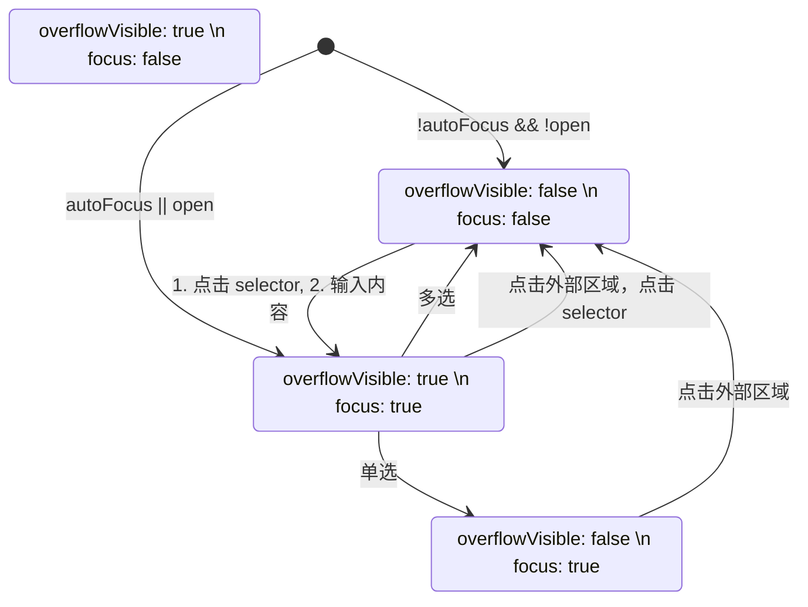

# ESDS.React 组件设计 - Select

## References

1. [研发设计文档](https://bytedance.feishu.cn/wiki/wikcnnTiWwJ2DblqHNJEV6EjLNe)
2. [UED 设计文档](https://bytedance.feishu.cn/docs/doccncAzYlx4L6sdlRir54FDI1b), [figma 预览](https://www.figma.com/file/38TSxc16xl5gW9iu74wpeh/%E3%80%90NEW%E6%96%BD%E5%B7%A5%E4%B8%AD%E3%80%9103-Desktop-Components?node-id=42%3A3262)
3. [AntD Select](https://ant.design/components/select/)
4. [Chakra Select](https://chakra-ui.com/select)
5. [React Select](https://react-select.com/home)

### Preview

[轻服务在线预览 Online Demo](https://ux-review-universe-ui.web.bytedance.net/?path=/docs/components-select--select-base)

## Literature review

### Chakra Select

Chakra Select 只是对 selector 的部分做了样式替换，option 还是用的原生 option，甚至下拉也都是原生的 select

### AntD Select

- Selector: 选择器显示选择结果的部分，可能只读也可能带交互
  - Basic Select: 点击 selector 弹出下拉菜单，selector 只读，选择后收起。右侧又有下拉指示，如果开启 allowClear，hover 的时候右侧覆盖一层 closeFill 按钮用于清除已输入的值。
  - Search Select: 点击 input selector 聚焦，弹出下拉菜单，输入字符串后 option list 会进行筛选，选择后收起。
  - Multiple Tag Select: 点击 tag input selector 聚焦，弹出下拉菜单，右侧无下拉指示，选择后不会自动收起，点击空白区域收起。已选择的 option 会以 ClosableTag 的形式存在，宽度不够时自动换行。
  - Tags Mode Select: 与 Multiple Tag Select 类似，但是输入字符串加回车可以输入 option list 中不存在的 tag。
- Option List: 对长列表进行虚拟滚动，加速下拉菜单的出现时间，可以自定义 option list renderer，renderer 会传入 menu 部分
  - Option: 可以通过 option label 自定义 option 的显示内容，通过 value 指定 option 对应的选项值。多选的 option 后面选中会有 checkOutline icon
  - Option Group: 其实就是增加一个分割符号
- 还有一堆杂七杂八的东西

### React Select

React Select 与 AntD 的不同点

- 专门提供了一个 async select 组件
- 有一类 creatable select 的抽象，不只是 multiple 的时候可以用，single 的时候也可以 create new option
- fixed option，可以保持一些 options 一定存在
- 他的 option 选择后会从 option list 中消失（与我们的设计不同）

## Composition

```yaml
SelectContainer:
  desc: select 的外层容器
  children:
    Selector:
      desc: select 的输入部分
      oneOf:
        InputSelector:
        TagMultipleSelector:
    SelectOverlay:
      OptionList:
        desc: select 下拉选项列表
        oneOf:
          EmptyOptionList:
            desc: 空状态的下拉列表
          LoadingOptionList:
            desc: loading 状态的选项下拉列表
          NormalOptionList:
            desc: 正常的 option list 组件
            children:
              oneOf:
                Option:
                  desc: 选项
                OptionGroup:
                  desc: 选项组
```

## Styles

### Selector

| selector 样式类型  | 样式描述                                             |
| ------------------ | ---------------------------------------------------- |
| basic selector     | 带圆角的矩形选择框，同 input                         |
| underline selector | 下划线选择框，类似 google 系列的设计                 |
| noborder selector  | 无边框选择框，没有任何边框的，只有内容和右边下拉按钮 |

## Attributes

### Select

```typescript
export interface BaseSelectProps extends SelectStateDrivedFromProps {
  /**
   * 使用可交互类型的 select 时，自动聚焦
   */
  autoFocus?: boolean;
  /**
   * 是否为错误态
   */
  danger?: boolean;
  /**
   * 是否可以输入
   */
  readOnly?: boolean;
  /**
   * 是否为不可选中状态
   */
  disabled?: boolean;
  /**
   * 使用可交互类型的 select 时，input 的占位符
   */
  placeholder?: string;
  /**
   * input 尺寸
   */
  size?: Extract<SizeType, 'md' | 'lg'>;
  /**
   * 边框样式
   */
  border?: 'normal' | 'noborder' | 'underlined';
  /**
   * Select option list，是 value option 或者 option group 的 list
   */
  options?: (SelectOptionType | SelectOptionGroupType)[];
  /**
   * Custom method to filter whether an option should be displayed in the menu
   */
  filterOption?: SelectFilterOptionFunc;
  /**
   * dropdown 是否和 select 宽度相同
   * @defaultValue true
   */
  dropdownMatchSelectWidth?: boolean | number;
  /**
   * style
   */
  style?: React.CSSProperties;
  /**
   * Select 内部使用到了内部元素组件，用户可以通过 props 自行渲染
   */
  optionRenderer?: (props: SelectOptionType) => React.ReactNode;
  optionGroupRenderer?: (props: SelectOptionGroupType) => React.ReactNode;
}

type SingleSelectValue = string;

export interface SingleSelectProps extends BaseSelectProps {
  /**
   * 是否为多选 select
   */
  multiple: false;
  /**
   * 受控 value
   */
  value?: SingleSelectValue;
  /**
   * 不受控 value
   */
  defaultValue?: SingleSelectValue;
  /**
   * Select 内部 value 变化触发的回调
   */
  onChange?: (option: SingleSelectValue, action: SelectAction<string>) => void;
}

type MultipleSelectValue = string[];

export interface MultipleSelectProps extends BaseSelectProps {
  multiple: true;
  value?: MultipleSelectValue;
  defaultValue?: MultipleSelectValue;
  onChange?: (
    options: MultipleSelectValue,
    action: SelectAction<string>
  ) => void;
}

export type SelectProps = SingleSelectProps | MultipleSelectProps;

export interface SelectStateDrivedFromProps {
  /**
   * 是否为多选
   */
  multiple: boolean;
  /**
   * 是否允许选中未自定义选项
   */
  allowCustomizedOption?: boolean;
```

### SelectOption

```typescript
export interface SelectOptionType {
  /**
   * select option 的 value 值，需要在整个 select option list 中保持唯一
   */
  value: string;
  /**
   * filter option 时用于匹配的 keyword，优先级为：1. keyword; 2. value; 3. label toString
   */
  keyword?: string;
  /**
   * option 显示的 ReactNode，如果未指定的话则直接使用 value
   */
  label?: React.ReactNode;
  /**
   * 是否为不可选中状态
   */
  disabled?: boolean;
}

export interface SelectOptionProps extends SelectOptionType {
  className?: string;
  style?: React.CSSProperties;
}
```

### SelectOptionGroup

```typescript
export interface SelectOptionGroupType {
  /**
   * select option group 的值，用于渲染
   */
  key: string;
  /**
   * Option group 显示的文字
   */
  label: React.ReactNode;
  /**
   * Option group 内部的 option list
   */
  options: SelectOptionType[];
}

export interface SelectOptionGroupProps extends SelectOptionGroupType {
  className?: string;
  style?: React.CSSProperties;
}
```

## Examples

使用样例

## Use Case & State & Sequence & Algorithm

### 用例列表

- selector
  - 外框样式
    - 全边框
    - 下边框
    - 无边框
  - 单选只读
    - 一般态
    - hover 态
    - active 态（下拉打开）
  - 带输入单选
    - inputting 态（输入）
  - 多选只读标签
    - tag 列表
    - 超出省略（+n）
      - popover
  - 带输入多选标签
    - inputting 态（输入）
  - 信息按钮
    - 一般态
    - hover 态
    - press 态
    - 点击后交互（？）
  - 清除按钮
    - 一般态
    - hover 态
    - press 态
  - 下拉指示图标
  - placeholder
- option list
  - option
    - 标题内容
    - 勾选标志
  - option group
    - 标题内容
    - 分割线
  - 加载态
  - 空状态
  - 下拉带搜索
- 表单状态
  - 错误状态
  - 不可用状态
- popover
  - trigger -（使用了 rc-trigger）
  - align
  - animation

### 内部状态

```typescript
export interface SelectStateDrivedFromProps {
  /**
   * 是否为多选
   */
  multiple: boolean;
  /**
   * 是否允许选中未自定义选项
   */
  allowCustomizedOption: boolean;
}

export interface SelectionState {
  /**
   * 选中的选项 set
   */
  options: TKeyValueMap<boolean>;
  /**
   * overlay 是否开启
   */
  overlayVisible: boolean;
  /**
   * 单选或多选 input 的输入值，也是 option filter 时的搜索值
   */
  inputValue: string;
  /**
   * 自己输入的非前置选项，在单选中则相当于直接作为最终结果
   */
  customizedOptions: TKeyValueMap<boolean>;
}
```

### Search input 交互方法

1. 点击 input 获取焦点，如果已有 select value 则显示 select value，否则显示 placeholder，下拉菜单打开
2. 输入 search value，option 进行 filter，placeholder 消失
3. up down key，进行预选选项切换，默认是第一个
4. 预选通过后，enter 或者 click 直接选中
5. search value 清空，进入 1 的状态



### 自动分词逻辑

1. 粘贴到多选框 input 的 searchValue 会经过 tokenSeparator 进行分割，得到 string[]
2. 如果 string[] 里的 value 不在 option list 里面，就过滤掉（multiple 逻辑，tag 模式的话不管）
3. 输入过程中如果遇到 tokenSeparator 字符，则进行一次 select，如果没找到的话就不选中任何东西
4. composition 过程不触发分割

### SelectedMap 逻辑

因为要与 antd 对齐，所以需要支持 option list 和 selectMap 不匹配的情况，也就是说 option 里面可能没有，但是 value 指定了就要再 selector 里显示。

## Accessibility considerations

无障碍设计

## TDL
