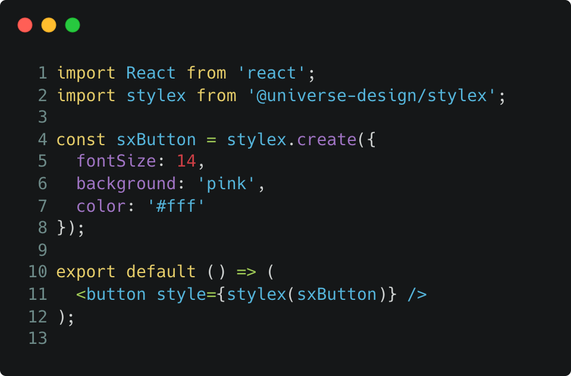

## 什么是 Stylex
Stylex 是一套编译时 CSS-in-JS 方案，它有以下优点：
### 运行时开销小
相比于传统的 CSS-in-JS 方案，Stylex 会提前生成 css，在运行时几乎不会带来运行时开销（有但很小）。

### 样式体积小
通过对原子样式的复用和极致的压缩算法，我们生成的样式体积比传统方案更小；
### 样式覆盖关系明确
对于传统 CSS 来言，样式的覆盖关系并不取决于类名的顺序，而是样式的加载顺序，这会带来很多不确定性。我们通过 js 来做样式合并，保证覆盖关系明确，不会产生样式冲突。

<!--  -->
 

<!-- 

用于解决我们在开发组件时遇到的 2 个问题：

1. 样式冲突问题。受引用关系、打包配置、加载策略等多重因素影响，同一份样式可能加载多次，两份样式可能加载顺序不定，这都容易引发
2. 样式体积。 组件库的状态和变种很多，我们往往需要写很多互相覆盖的样式，这些样式往往并未很好的去重，另外选择器往往很长， -->

## 快速开始
### 安装
```ts
//stylex
npm install @universe-design/stylex
// babel plugin
npm install @universe-design/babel-plugin-transform-stylex --dev
```

### Babel 配置
```ts
{
  //...
  plugins: [
    [
      require.resolve('@universe-design/babel-plugin-transform-stylex')
    ],
  ],
}
```
 

### 编写 CSS

<code src="../demos/basic.tsx" />

## 和竞品的关系
Build-time CSS-in-JS 并不是一个新话题，我们参考了社区的一些经验和代码：
1. Stylex 这个名字来自 facebook，我们的灵感来源自他们的技术分享，所以用了他们一样的名字，不过我们开始做的时候他们并未开源。

2. CSS-in-JS 的一大难题是对样式的解析，需要将 js 对象解析成多条原子样式，我们这一部分能力 fork 自 [Griffel](https://griffel.js.org/)。
